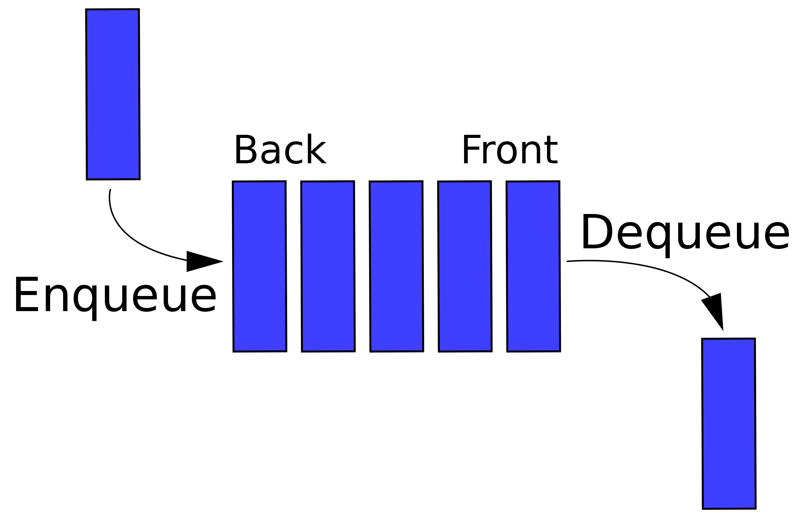

# Queue
Queue is a first-in-first-out (FIFO) ordered list: the datum comes in first comes out first, and the datum comes in last comes out last.



When new data come in they are added to the *rear*. The data come out at *front*. This means when front cursor moves only when data come out, and *rear* cursor moves only when data come in.

### Code implementation
As an ordered list, a queue can be implemented using either an array or a linked list. Here we will use array.

#### Implementing using unidirectional array
Besides the array, a queue should also have a `max size`, a `rear` cursor and a `front` cursor.
```java
public class ArrayQueue<T>
{
	int front = -1;
	int rear = -1;
	int maxSize;
	Object[] queue;
}
```
Here we use `front` exclusively and `rear` inclusively, where `front` points to one element **before** the head and `rear` points to **just** the element at the tail.

They both start from -1. We do not use 0 as the start as that means there is already an element in the queue.

Add a constructor to specify `maxSize` and to initialise `queue`:
```java
public ArrayQueue(int maxSize)
{
	this.maxSize = maxSize;
	this.queue = new Object[maxSize];
}
```

Now we are going to enqueue and dequeue data.

As aforementioned, the `rear` cursor should move when new data enqueue.</br>
We should also check if the queue is full already.
```java
public boolean enqueue(T elem)
{
	if (this.isFull()) return false;

	this.rear++;
	this.queue[rear] = elem;
	return true;
}
```

Where the auxiliary method `isFull` is defined as
```java
public boolean isFull()
{
	return this.rear == this.maxSize - 1;
}
```

And now dequeue data. As aforementioned, the `front` cursor should move when dequeuing.</br>
We should make sure the queue is not empty, otherwise an exception should be thrown.</br>
After popping out the element, restore its position to a default value (can be defined in a constructor).
```java
@SuppressWarnings("unchecked")
public T dequeue()
{
	String err = "Cannot dequeue an empty queue";
	if (this.isEmpty()) throw new RuntimeException(err);

	// front always point to the element *before* head
	// so front++ points to the dequeuing elem.
	this.front++;

	// the type cast throws compiler warning.
	// disabled with annotation.
	T res = (T)this.queue[front];

	// restoring this elem to $defaultVal.
	this.queue[front] = defaultVal;

	return res;
}
```

Where the auxiliary method `isEmpty` is defined as
```java
public boolean isEmpty()
{
	return this.rear == this.front;
}
```

Till now we have finished most features of a queue, where you can enqueue and dequeue data, while checking if the queue is full or empty.

Let's add some more features:

Check size:
```java
public int size()
{
	return this.rear - this.front;
}
```

Peek the most front element:
```java
@SuppressWarnings("unchecked")
public T peek()
{
	String err = "Cannot dequeue an empty queue";
	if (this.isEmpty()) throw new RuntimeException(err);

	return (T)this.queue[front + 1]; // suppressed warning
}
```

`toString()` override:
```java
public String toString()
{
	return toString(" , ");
}

public String toString(String sep)
{
	String[] body = new String[this.maxSize];
	for (int i = 0 ; i < maxSize ; i++)
	{
		Object o = this.queue[i];

		body[i] = (o == null ? "" : o.toString());
	}

	return format("[%s]" , join(sep , body));
}
```

##### Flaw
You may have spotted that cells are no longer reused after its element been popped out. This could be a great memory waste.

To optimise memory use, we can use the idea of circular array.

#### Optimising with circular array
Circular array in short: connecting head and tail of an array. So when a cursor exceeds array length, it should be restored to 0.

We are not going to apply that to `front` or `rear`, or it could be tough to calculate queue size. Instead, these two cursors can go on infinitely; if we'd like to look at what's their index, we could use their modulo with queue size.

Suppose we have a circular array of length 4. If a cursor is on 5, then it is on position 1 as 5 % 4 = 1; if it is on 7, then it is on position 3; a diagram could be helpful for understanding.

We can write a method to calculate this index:
```java
private static int index(int cursor , int length)
{
	return cursor % length;
}
```

With help of index positions, we can rewrite `enqueue` and `dequeue` as to avoid index of bound error:
```java
public boolean enqueue(T elem)
{
	if (this.isFull()) return false;

	this.rear++;
	this.queue[index(rear , maxSize)] = elem;
	return true;
}
```
```java
@SuppressWarnings("unchecked")
public T dequeue()
{
	String err = "Cannot dequeue an empty queue";
	if (this.isEmpty()) throw new RuntimeException(err);

	// front always point to the element *before* head
	// so front++ points to the dequeuing elem.
	this.front++;

	int frontIndex = index(front , maxSize);

	// the type cast throws compiler warning.
	// disabled with annotation.
	T res = (T)this.queue[frontIndex];

	// restoring this elem to $defaultVal.
	this.queue[frontIndex] = defaultVal;

	return res;
}
```

We also need to rewrite `isFull`. This time we simply check if number of elements equals max capacity:
```java
public boolean isFull()
{
	return (rear - front == maxSize);
}
```

`isEmpty` works fine and do not need a change.

Also modify method `peek` in case of array index out of bound:
```java
@SuppressWarnings("unchecked")
public T peek()
{
	String err = "Cannot dequeue an empty queue";
	if (this.isEmpty()) throw new RuntimeException(err);

	int frontIndex = index(front , maxSize);

	if (frontIndex + 1 == maxSize) return (T)this.queue[0];
	return (T)this.queue[frontIndex + 1];
}
```

A circular array queue is herein implemented. To test, it is better to use jshell for real-time results.
